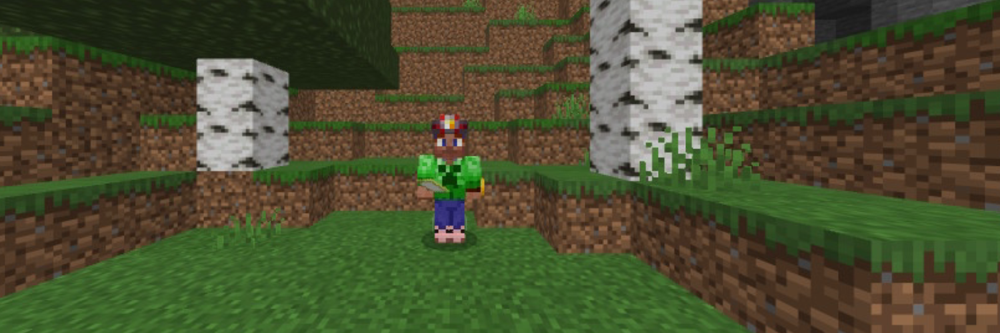
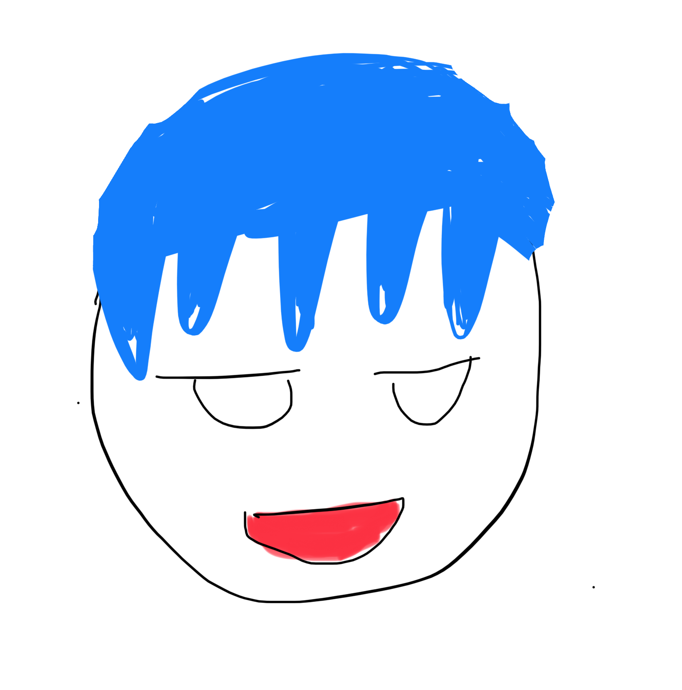

# satoshiinu3104のページ

<html>
	<head>
		<link rel="shortcut icon" type="image/x-icon" href="https://satoshinu3014.github.io/favicon.ico">
		<link href="https://cdn.jsdelivr.net/npm/bootstrap@5.1.3/dist/css/bootstrap.min.css" rel="stylesheet" integrity="sha384-1BmE4kWBq78iYhFldvKuhfTAU6auU8tT94WrHftjDbrCEXSU1oBoqyl2QvZ6jIW3" crossorigin="anonymous">
		
		
	</head>
	<body style="background-image: url(b122.jpg);">
		
		
		

			
				

					
					さとしいぬが適当にする場所
					
				

		

		
 
		

			

				

					
					

						
							ツール
						
					

				

				<a href="/calc/" >電卓</a> 
				<a href="/minecraft_texture/" >マイクラテクスチャー配布</a>
				

					
					

						
							自己紹介など
						
					

				

				<a href="/profile/">自己紹介</a> 
				ライン公式 
				

				

					
					

						
							ブログ
						
					

				

				
				<a href="/minecraft/">マイクラ</a>
			

		

	</body>
</html>

