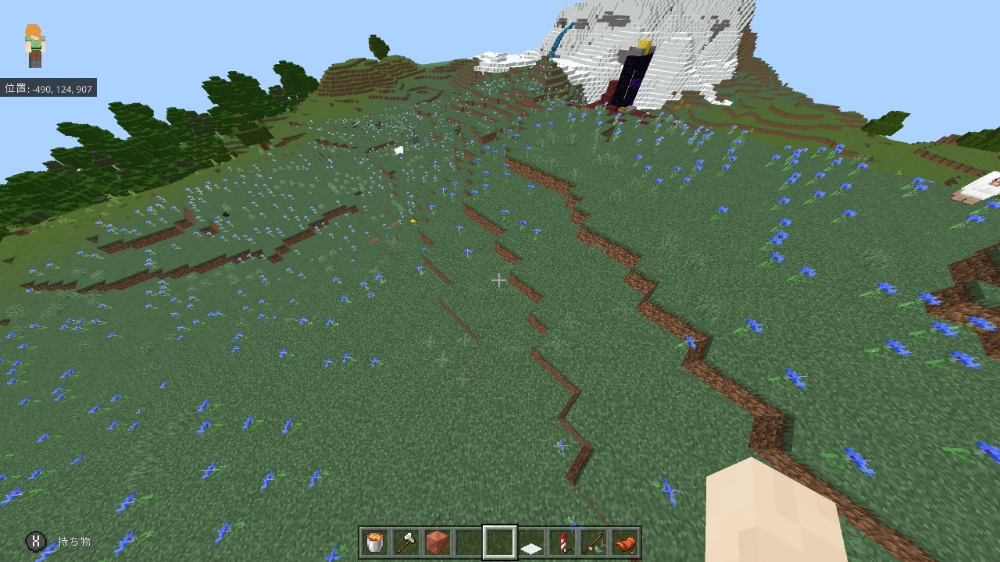
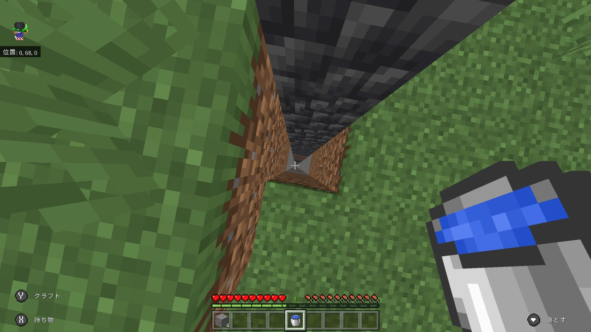
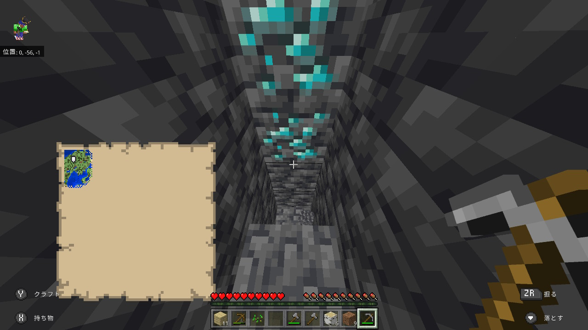
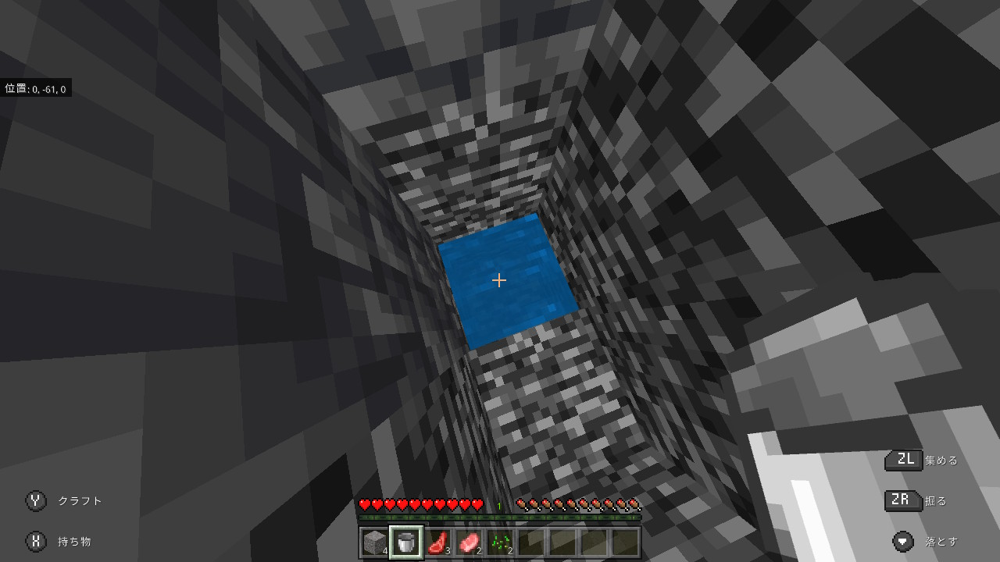
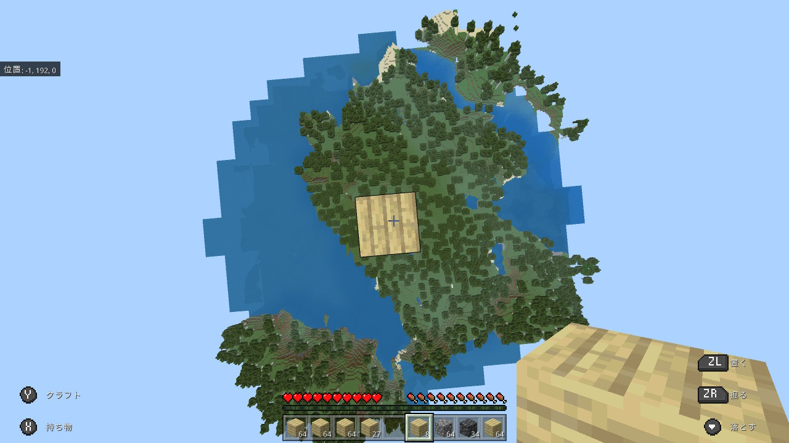
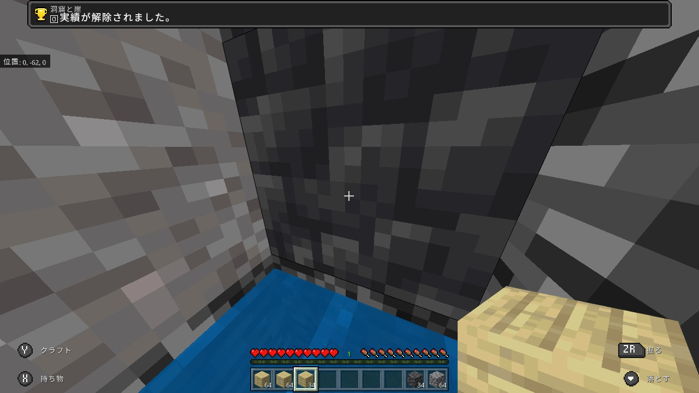

<html>
	<body>
		<a href="../">戻る</a> 
		<h1>統合版マインクラフト1.18アップデートで追加された実績やってみた</h1>
		<h4>まず一つ目の実績はサウンドオブミュージックという実績です 牧草地でジュークボックスで音楽を鳴らす実績です、レコードは何でもいいのでpigstepや11とかダンジョンでとってきたやつでもいいです ジュークボックスとレコードもってチャンクベースで牧草地探してその座標にエリトラで飛んで行ってレコード鳴らせばOK  牧草地の画像</h4> 
		 
		<h4></h4> 
		<h4>バイオームファインダー
			<a href="https://www.chunkbase.com/apps/biome-finder">https://www.chunkbase.com/apps/biome-finder</a>
		</h4>
		<h4>二つ目の実績は洞窟と崖という実績です 1.18アップデートで増えたy320からy-64まで飛び降りて生き残る実績です そのために穴掘ってみました</h4> 
		 
		<h4>途中でダイヤ見つけました</h4> 
		 
		<h4>水を一番下に置きます</h4> 
		 
		<h4>一番上までブロックを積み上げて登ります</h4> 
		 
		<video src="m.mp4" poster="m.jpg" preload="metadata" controls width="640" height="360" >
				
動画を再生するにはvideoタグをサポートしたブラウザが必要です。

		</video> 
		<h4>実績獲得</h4> 
		 
		<a href="../">戻る</a> 
	</body>
</html>
