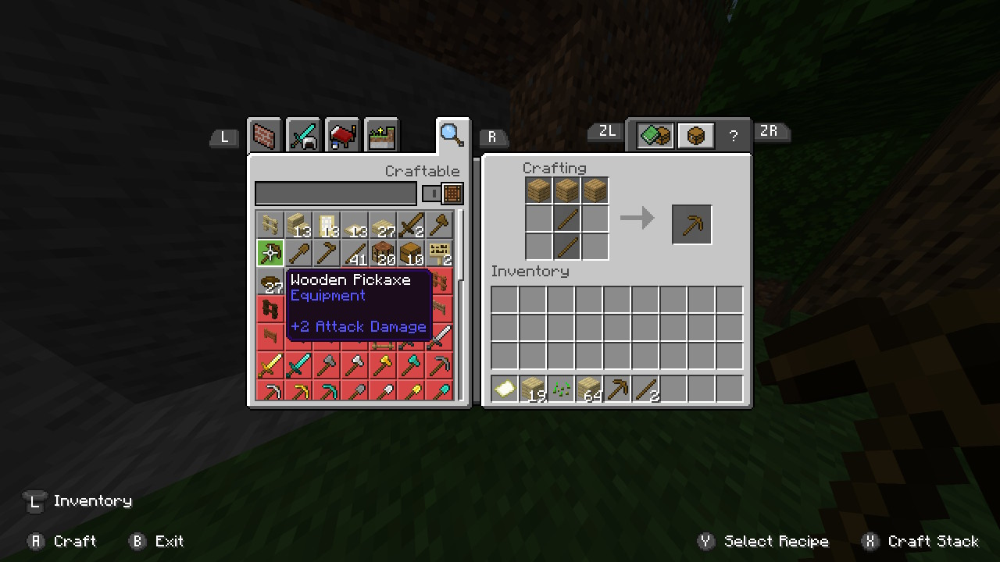
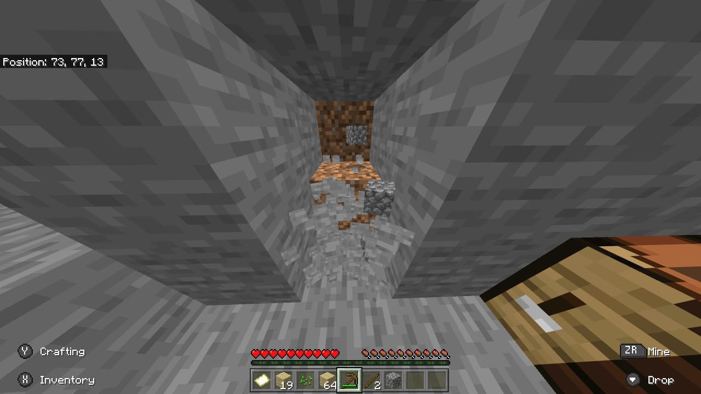
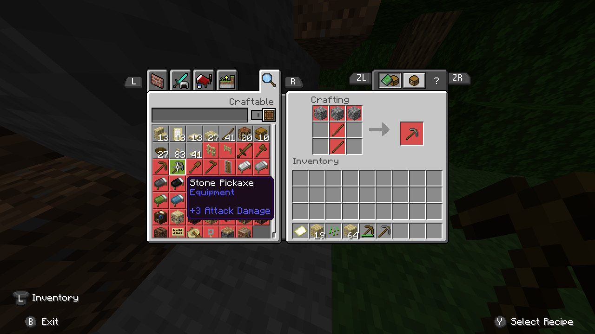
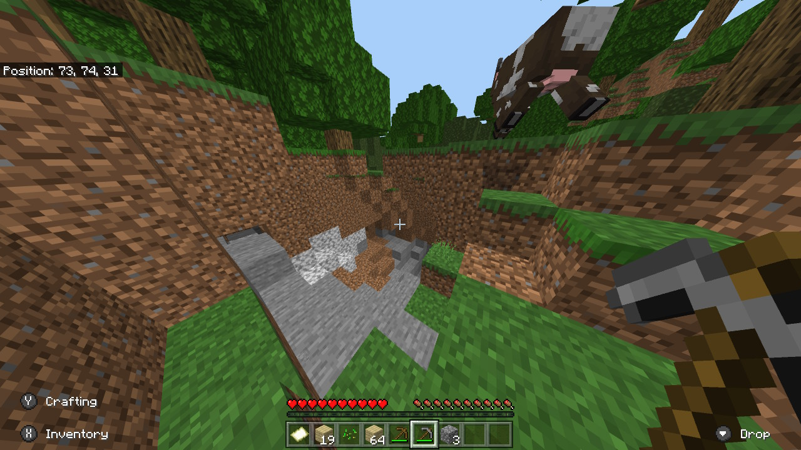
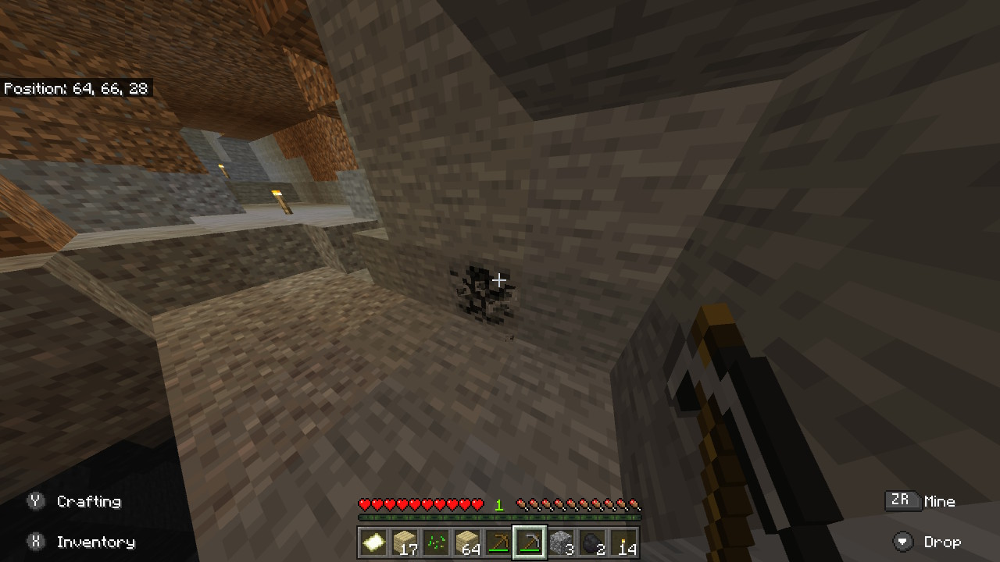
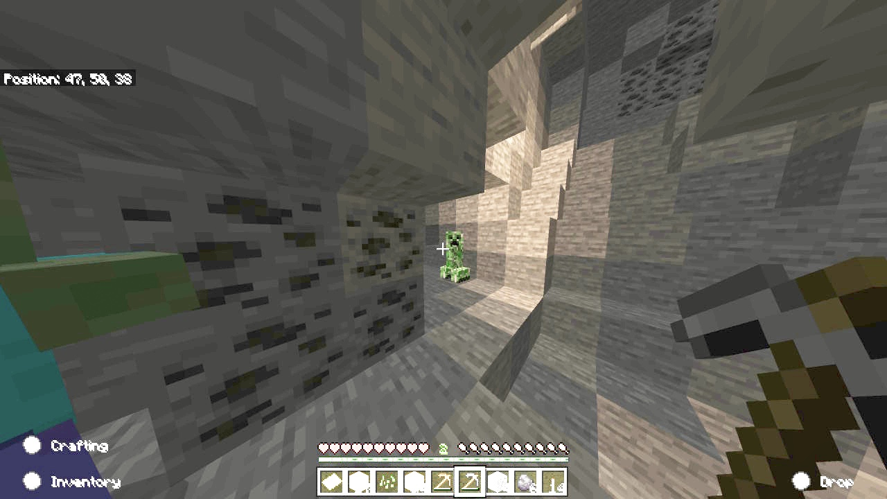
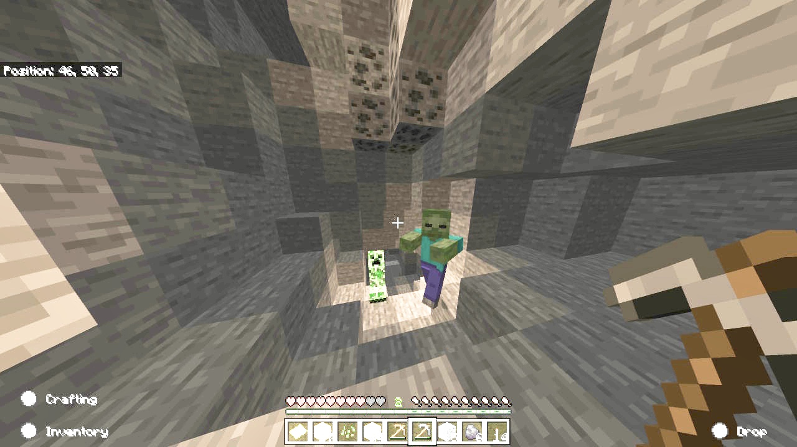
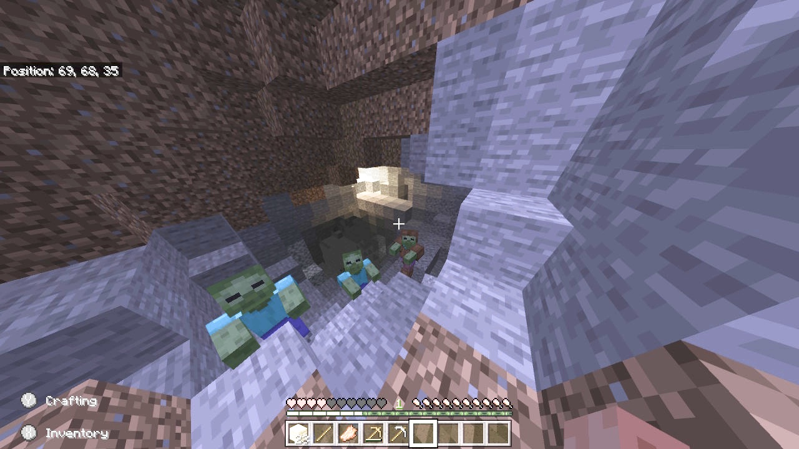

<html>
  <body>
    <h1>今回からマインクラフトサバイバルモードをやっていこうとおもいます！！！！！！！</h1>
    
    <h4>まずは木を切って</h4>
    
    <h4>作業台を作り</h4>
    
    <h4>木のツルハシを作って</h4>
    
    <h4>石を掘ります</h4>
    
    <h4>そしたら石のツルハシを作る！ ということで洞窟探検準備OK!</h4>
    
    <h4>ということで洞窟レッツゴー</h4>
    
    <h4>石炭ほりほり</h4>
    
    <h4>クリーパー！にげ…</h4>
    
    <h4>こっちもかよ！</h4>
    
    <h2>5分後</h2>
    <h4>めっちゃついてきたし</h4>
    
    
    
    
    
  </body>
</html>
