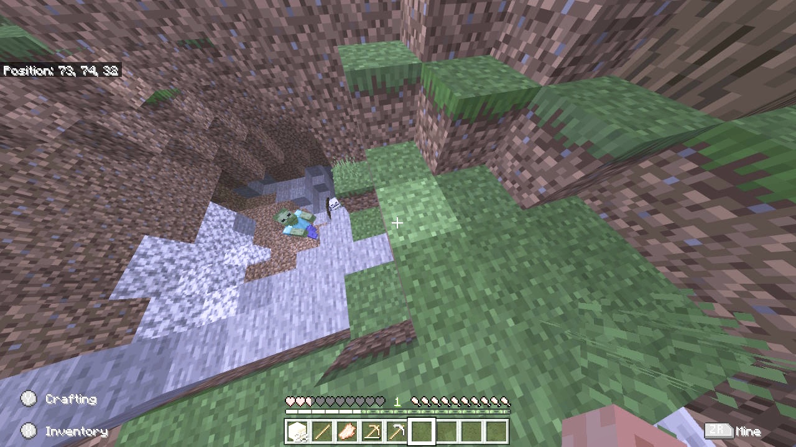

<html>
  <body>
    <a href="../">戻る</a> 
    
    <h1>今回からマインクラフトサバイバルモードをやっていこうとおもいます！！！！！！！</h1> 
     
    <h4>まずは木を切って</h4> 
     
    <h4>作業台を作り</h4> 
     
    <h4>木のツルハシを作って</h4> 
     
    <h4>石を掘ります</h4> 
     
    <h4>そしたら石のツルハシを作る！ ということで洞窟探検準備OK!</h4> 
     
    <h4>ということで洞窟レッツゴー</h4> 
     
    <h4>石炭ほりほり</h4> 
     
    <h4>クリーパー！にげ…</h4> 
     
    <h4>こっちもかよ！</h4> 
     
    <h2>5分後</h2> 
    <h4>めっちゃゾンビついてきたし</h4> 
     
    <h4>スケさんもきたーーー</h4> 
     
    <h4>二分後</h4> 
    <h4>鉄見つけたー！</h4> 
     
    <h4>新アイテム銅もゲット</h4> 
     
    <h2>五分後</h2> 
    <h4>本日の成果</h4> 
     
    <h4>ということでまた次回！ 次回は建築回です！(多分) ということでじゃーねー</h4> 
    
    
    <!--
 
<h4>ということでまた次回！ 次回は建築回です！(多分) ということでじゃーねー</h4> -->
    
    <a href="../">戻る</a> 
  </body>
</html>
